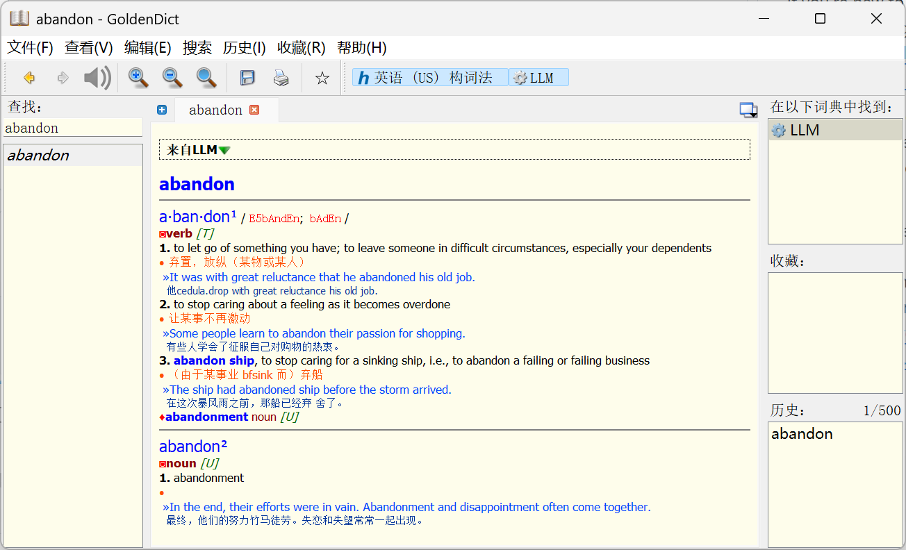
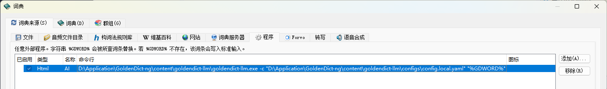

# goldendict-llm

使用 Golang 编写的 GoldenDict 外部程序，用于对接 LLM API 进行翻译。



## 1. 使用方式

### 1.1 下载可执行文件

从 [Release](https://github.com/gitsang/goldendict-llm/releases/latest) 中下载 `goldendict-llm.exe`

### 1.2 编写配置文件

你可以定义不同的 Adapter 以便通过修改 `adapter` 字段快速切换。

```yaml
adapter: siliconflow

adapters:
  openai:
    url: "https://api.openai.com/v1/chat/completions"
    token: "your-api-key-here"
    model: "gpt-3.5-turbo"
  siliconflow:
    url: "https://api.siliconflow.cn/v1/chat/completions"
    token: "your-api-key-here"
    model: "Qwen/Qwen2.5-7B-Instruct"
```

### 1.3 在词典中配置程序

命令行应该类似如下：`C:\GoldenDict\goldendict-llm.exe -c "C:\GoldenDict\config.yaml" "%GDWORD%"`


